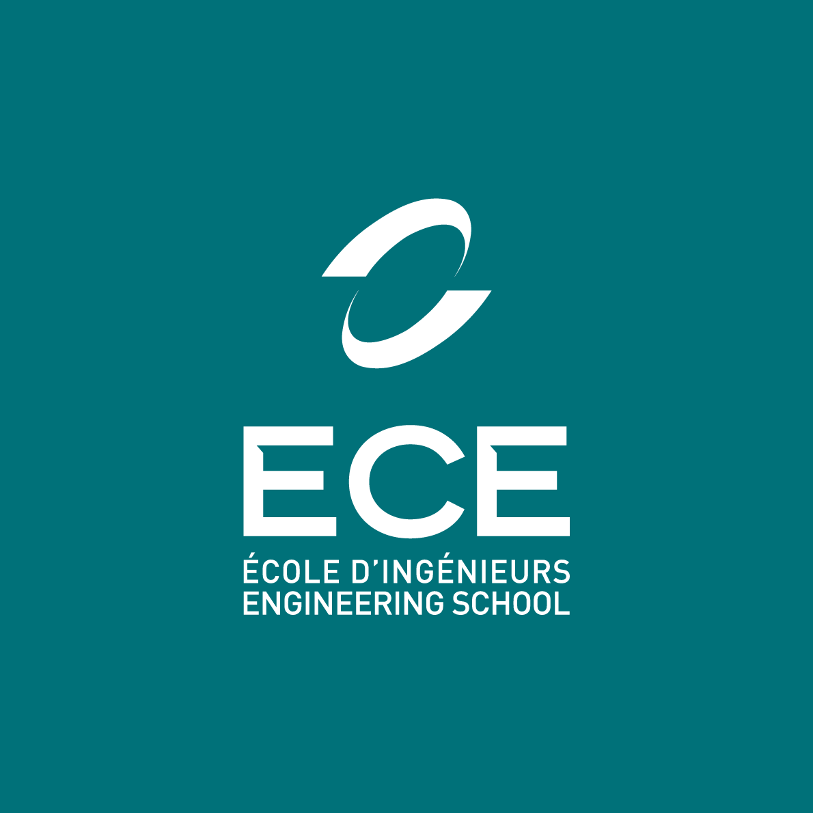

<!--
# Style lead only for this slide
_class: lead
-->

Projet d'informatique
Algorithmique et langage C

   

# ECE-WORLD  🎪🦆🎈🎸🐍

   

2022-2023

---

# 👨‍💻Rapide Contexte du jeu

Notre jeu est sur le thème des 4 éléments, nous avons donc fais chacun un jeu sur le thème de chaque éléments. 

## 👩‍💻thème de nos jeux : 

- Pêche aux canards : eau 💧
- Tir au ballon : air 🌬️
- Guitare héro : feu 🔥
- Snake : terre 🌍

---
## 👩‍💻La carte et les deux personnages :

---
# 🦆Comment fonctionne le jeu de la pêche aux canards:

-Les canards sont représentés par...

---
# 🎈Comment fonctionne le jeu du tir à la carabine:
-Les ballons sont des structures qui bougent

---
# 🎸Comment fonctionne la guitare héro:
-
---
# 🐍Comment fonctionne le snake:
-
---

# 👨‍💻Comment en sommes nous arrivés à ce résultat ?

- Une conception réalisée en équipe
- Une structuration des données dès le début 
- Une répartition des tâches

---
# 👩‍💻Comment avons-nous travaillé ?

- Une première réunion pour faire la conception et se répartir les taches
- Nous avons codé chacun de notre côté la plupart du temps
- En cours nous nous sommes entraidés et nous nous sommes motivé

---
# 👨‍💻Comment se déroule une partie ?

- Affichage de la carte
- Déplacement des joueurs sur la carte et choix de jeu
- Déroulement du jeu choisi
- Distribution du ticket au gagnant
- Retour à la carte
- Lors de la fin de la partie, on compare les tickets et déclare le grand gagnant

---
# 🕺Bilan du Projet et du groupe

- Ce qui peut être amélioré dans le code
- Ce qui peut être amélioré dans le groupe